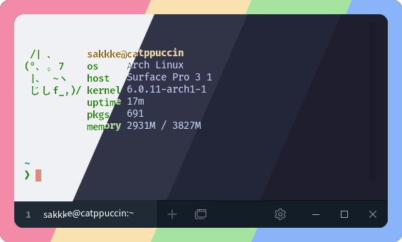
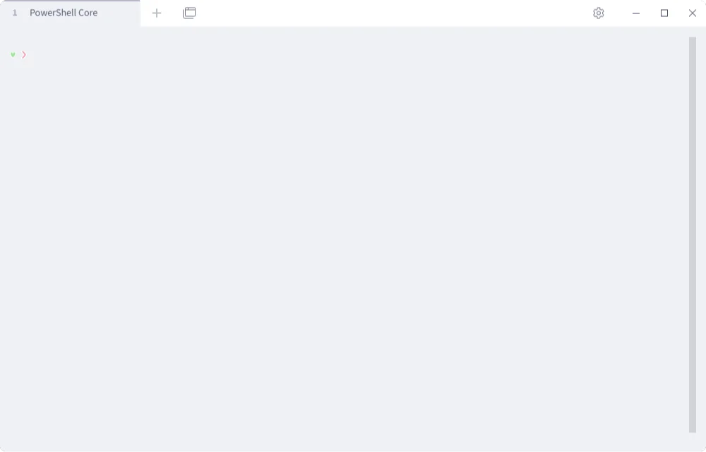
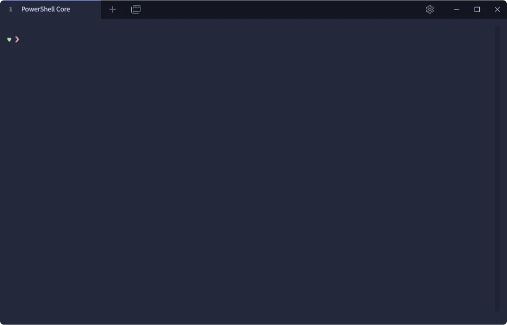
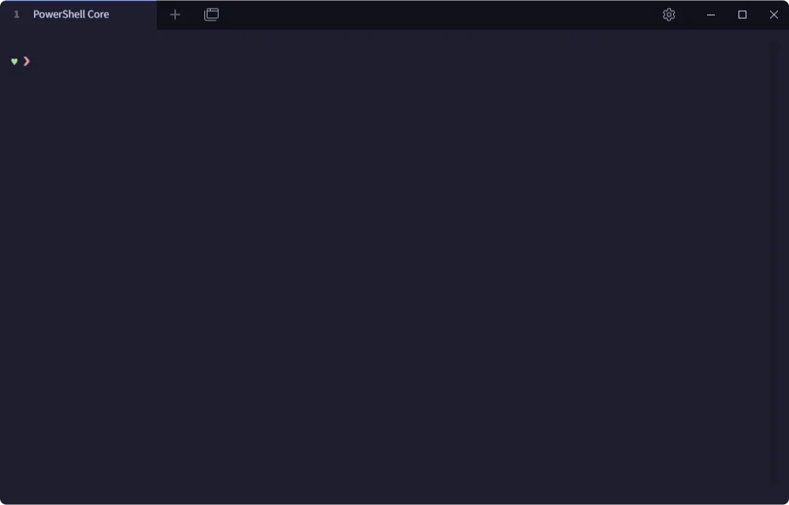

<h3 align="center">
	 
	
	Catppuccin for <a href="https://github.com/eugeny/tabby">Tabby</a>
	
</h3>

	
	
	

	

## Previews

🌻 Latte

🪴 Frappé

🌺 Macchiato

🌿 Mocha

## Usage

1. Copy the contents of your flavor of choice from [`themes/`](./themes/) to `.terminal.customColorSchemes[]` in your [Tabby configuration file](https://github.com/Eugeny/tabby/wiki/Config-file#location).
2. Open Tabby settings and navigate to the _Color Scheme_ section to change the current color scheme.
3. In the _Appearance_ section to set _Terminal background_ to _From color scheme_.

## 💝 Thanks to

- [Konosuke Sakai](https://github.com/sakkke)

&nbsp;

	

	Copyright &copy; 2021-present <a href="https://github.com/catppuccin" target="_blank">Catppuccin Org</a>

	

